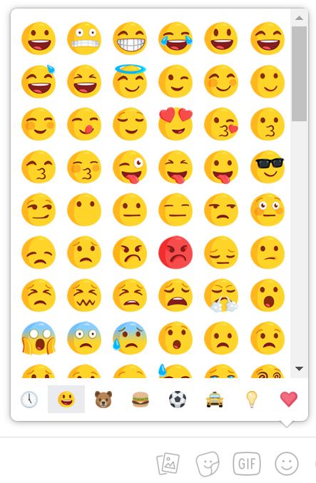
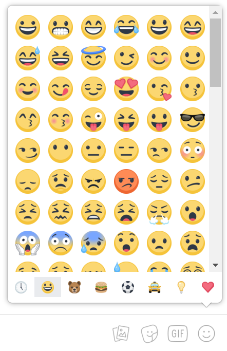
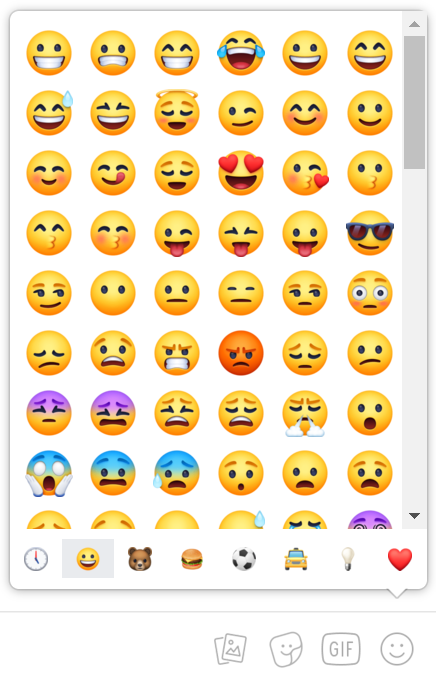

# Make Facebook Emojis Great Again
I don't like Facebook messenger's "new" emojis. In fact, I _loved_ their previous iteration of emojis. Maybe you feel
the same way. Luckily, all hope is not lost--the old emojis aren't entirely gone. So I've written a
user script to make messenger show the old emojis for whomever has it installed.

Huzzah!  

## Installation
Because you might not care to look through all the pictures
1. Install [Tampermonkey](https://tampermonkey.net/) browser extension (or [Firefox's Greasemonkey](https://addons.mozilla.org/en-US/firefox/addon/greasemonkey/)).  
  a. These add-ons/extensions allow you to install user scripts which can run Javascript code to customize your browsing experience on various websites.  
  b. **WARNING**: user scripts (also known as Greasemonkey scripts) _can_ be dangerous. Make sure you trust any script you install.  
2. Install [Make Facebook Emojis Great Again user script](https://github.com/MCWoo/MakeFbEmojisGreatAgain/raw/master/make_fb_emojis_great.user.js).

## What does it do

| Old emojis                        | Not these ugly new emojis         |
| --------------------------------- | --------------------------------- |
|  |  |

### It works in facebook.com chat, as well as messenger.com.  
 

### But not outside of that, like in Facebook statuses. This is possible, but not all the new emojis map back to the old ones 

### I also didn't go past the cat emojis, since the ones I primarily wanted were the smileys.

# Updates

## v1.1 - 2018/7/20
Adds mappings for 16, 32, and 64 pixel images so we're not always using 128x128 pixel images. Reformat (while maintaining readability) to reduce userscript's memory usage.

## v1.2 - 2018/8/20
Adds support for clicking+holding emojis as they increase in size in chat.

## v1.3 - 2018/11/29
Adds support for replacing new version of emojis.  

